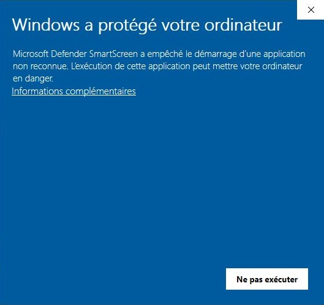
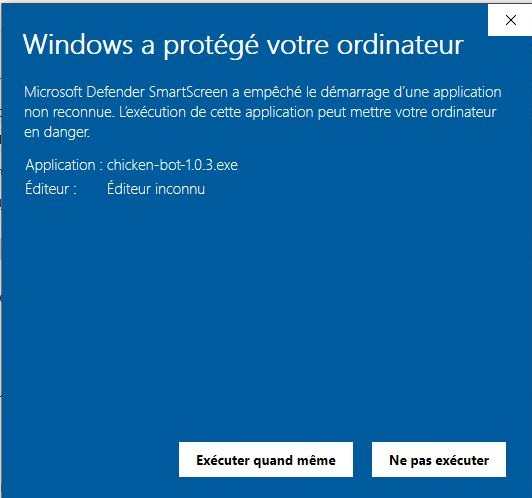

# Chicken-bot setup

This bot documentation helps you to install the bot application on your workstation.


## Download the application

Go to the home page of this website to download last version of the chicken-bot.

➡️ https://chickarmy.github.io/chickenbot-web/


## First start of the Chicken-bot

Once the executable file is located on your workstation, start it !

```bash
 chicken-bot.exe
```

- ➡️ cf. Notice about performances
- ➡️ cf. Notice about security

A desktop application popup must appears. You're in ! 

Continue by reading **[bot user guide](/docs/category/user-guide)**.

To get more advanced tips about setup, cf. [this page](./setup-advanced.md).

### Notice about performances
This application is an [ElectronJS](https://www.electronjs.org/) desktop application that embeds Chromium browser and could takes so much time to appears especially the first time. Be patient. 

### Notice about general security
As this application is an executable you must be warn of this commons rules:
- you must always retrieve official binaries from official websites. For chicken-bot, the official resource is chickenbot-web/release : https://github.com/chickarmy/chickenbot-web/releases. This resource site is used by [official website](https://chickarmy.github.io/chickenbot-web/fr/).
- you must always double-check binary BEFORE executing them from your local anti-virus / anti-malware application and trusted on-line services. One good way to do that is to drop any downloaded files onto https://virustotal.com website and wait for full analysis from different security providers.
- ➡️ You may notice that chicken-bot exe produces a false positive from `Bkav pro` security provider (cf. ticket [#49](https://github.com/chickarmy/chickenbot-web/issues/49)).

### Notice about MS Windows security

As chicken-bot executable is NOT coming from Microsoft trusted source, Windows will produce some popup to warn you. You must accept them in order to launch app.



➡️ click on "Informations complémentaires"




➡️ click on "Exécuter quand même" (only when you're confident regarding security analysis).